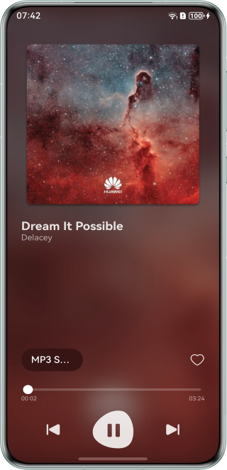

# Audio Quality Switching

## Overview

This sample demonstrates how to switch audio quality between AVPlayer (for MP3 and FLAC formats) and AudioRenderer (for PCM format). It also helps you understand the conversion between the byte-based playback progress of AudioRenderer and the time-based playback progress of AVPlayer.


## Effect

| Home Page                        | 
|----------------------------------|
|  |

## How to Use
1. Download the sample code and open the application.
2. Tap to switch the audio format. The options are MP3, FLAC, and PCM.

## Project Directory

```
├──entry/src/main/ets/
│  ├──common
│  │  └──Constants.ets                 // Constants
│  ├──components                       // Module components
│  │  └──ControlAreaComponent.ets      // Components in the audio control area
│  ├──entryability
│  │  └──EntryAbility.ets              // Entry ability lifecycle callbacks
│  ├──entrybackupability
│  │  └──EntryBackupAbility.ets        // EntryBackupAbility lifecycle callbacks 
│  ├──model                        
│  │  └──SongData.ets                  // Song entity
│  ├──pages                             
│  │  └──Index.ets                     // Home page
│  ├──player                             
│  │  ├──AudioRendererController.ets   // AudioRenderer playback control
│  │  ├──AVPlayerController.ets        // AVPlayer playback control
│  │  └──PlayerController.ets          // Global playback control
│  └──utils
│     ├──ColorTools.ets                // Background color utility
│     ├──Logger.ets                    // Log utility
│     └──MediaTools.ets                // Media utility
└──entry/src/main/resources            // Static resources
```

## How to Implement
1. Implement MP3 and FLAC playback using AVPlayer, including AVPlayer initialization, playback, and pause operations.
2. Implement PCM playback using AudioRenderer, including AudioRenderer initialization, playback, and pause operations.
3. Record the current playback progress of both AVPlayer and AudioRenderer: AVPlayer tracks the time-based progress, while AudioRenderer records progress based on the number of file bytes read.
4. Achieve bidirectional progress conversion between AVPlayer and AudioRenderer when switching audio formats.

## Required Permissions

N/A

## Dependencies

N/A

## Constraints

1. This sample is only supported on Huawei phones running standard systems.
2. The HarmonyOS version must be HarmonyOS 6.0.0 Release or later.
3. The DevEco Studio version must be DevEco Studio 6.0.0 Release or later.
4. The HarmonyOS SDK version must be HarmonyOS 6.0.0 Release SDK or later.