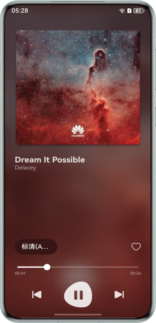

# 实现音质切换

## 项目简介

本案例实现了音质切换的功能，指导开发者了解在AVPlayer和AudioRenderer之间如何进行切换播放。其中，AVPlayer用于播放MP3、FLAC的音频格式，AudioRenderer用于播放PCM的音频格式。同时，还包含了AudioRenderer播放字节进度与AVPlayer播放时间进度之间的转化。


## 效果预览

| 主页面                                  | 
|--------------------------------------|
|  |

## 使用说明
1. 安装进入应用。
2. 点击切换音频格式，音频格式包含MP3、FLAC、PCM三种格式。

## 工程目录

```
├──entry/src/main/ets/
│  ├──common
│  │  └──Constants.ets                 // 常量
│  ├──components                       // 各模块组件
│  │  └──ControlAreaComponent.ets      // 音频操控区组件
│  ├──entryability
│  │  └──EntryAbility.ets              // Ability的生命周期回调内容
│  ├──entrybackupability
│  │  └──EntryBackupAbility.ets        // EntryBackupAbility的生命周期回调内容
│  ├──model                        
│  │  └──SongData.ets                  // 歌曲实体
│  ├──pages                             
│  │  └──Index.ets                     // 首页
│  ├──player                             
│  │  ├──AudioRendererController.ets   // AudioRenderer播放控制
│  │  ├──AVPlayerController.ets        // AVPlayer播放控制
│  │  └──PlayerController.ets          // 整体播放控制
│  └──utils
│     ├──ColorTools.ets                // 背景颜色工具类
│     ├──Logger.ets                    // 日志工具类
│     └──MediaTools.ets                // 媒体工具类
└──entry/src/main/resources            // 应用静态资源目录
```

## 具体实现
1. 通过AVPlayer实现播放MP3、FLAC的功能，包括AVPlayer初始化、播放、暂停等功能。
2. 通过AudioRenderer实现播放PCM的功能，包括AudioRenderer初始化、播放、暂停等功能。
3. 记录AVPlayer与AudioRenderer的当前播放的进度。其中，AVPlayer记录的为时间进度，AudioRenderer记录的为文件字节读取的进度。
4. 在切换音频格式时，将AVPlayer与AudioRenderer之间的进度相互转化。

## 相关权限

不涉及

## 依赖

不涉及

## 约束与限制

1. 本示例仅支持标准系统上运行，支持设备：华为手机。
2. HarmonyOS系统：HarmonyOS 6.0.0 Release及以上。
3. DevEco Studio版本：DevEco Studio 6.0.0 Release及以上。
4. HarmonyOS SDK版本：HarmonyOS 6.0.0 Release SDK及以上。